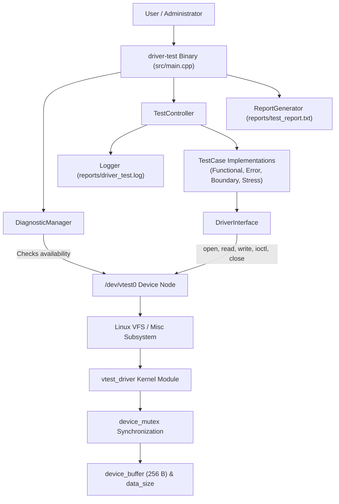

# Architecture Document
## Linux Device Driver Testing and Diagnostic Framework

---

# 1. Architecture Overview

The **Linux Device Driver Testing and Diagnostic Framework** is structured into two primary execution spaces:
1. **Kernel Space**: A custom Linux miscellaneous character device driver module (`vtest_driver.ko`) that exposes the character device node `/dev/vtest0` with internal buffer storage and kernel mutex protection.
2. **User Space**: An object-oriented C++17 testing framework executable (`driver-test`) that encapsulates system calls, coordinates test dispatching, monitors pre-flight diagnostics, logs execution events, and produces structured test reports.

The complete system comprises the following components:
- **C++17 User-Space Testing Framework**: The overarching application driving verification.
- **`DriverInterface` Abstraction**: An abstraction layer encapsulating low-level POSIX character device system calls.
- **Linux Kernel Virtual Miscellaneous Character Device Driver**: The kernel module implementing device operations in Ring 0.
- **Virtual Device Node `/dev/vtest0`**: The filesystem entry point for user/kernel space interaction.
- **`DiagnosticManager`**: Pre-test validation component ensuring driver accessibility.
- **`TestController`**: Test dispatch and execution coordinator.
- **`FunctionalTest`**: End-to-end character device functional validation test.
- **`ErrorTest`**: Invalid IOCTL command rejection test.
- **`BoundaryTest`**: Buffer overflow protection and payload clamping test.
- **`StressTest`**: 100-cycle repeated read/write reliability test.
- **`Logger`**: Categorized console and file logging utility.
- **`ReportGenerator`**: Itemized test summary and statistics generator.

---

# 2. High-Level Architecture

The execution path originates from user space, flows through standard Linux system calls to the virtual device file, is dispatched by the Linux VFS to the custom kernel driver, and operates on protected in-memory state:

```text
User / Administrator
        ↓
    driver-test
        ↓
DiagnosticManager
        ↓
  TestController  ──>  Logger (reports/driver_test.log)
        ↓
    Test Cases (Functional, Error, Boundary, Stress)
        ↓
 DriverInterface
        ↓
Linux System Calls (open, read, write, ioctl, close)
        ↓
   /dev/vtest0
        ↓
Linux VFS / Misc Device Subsystem
        ↓
vtest_driver Kernel Module
        ↓
[device_mutex] ──> device_buffer (256 B) / data_size
        ↓
ReportGenerator (reports/test_report.txt)
```

### Architecture Diagram



During execution, `Logger` appends execution events to `reports/driver_test.log`, while `ReportGenerator` compiles individual test outcomes into `reports/test_report.txt`.

---

# 3. User-Space Components

## DriverInterface
- **File**: `include/driver_interface.h`, `src/driver/driver_interface.cpp`
- **Responsibility**: Wraps low-level POSIX file operations (`open`, `read`, `write`, `ioctl`, `close`) against `/dev/vtest0`.
- **Key Methods**:
  - `openDevice()`: Calls `open("/dev/vtest0", O_RDWR)` and stores the file descriptor.
  - `writeData(const std::string&)`: Issues `write()` to `/dev/vtest0` and returns `true` when bytes written > 0.
  - `readData()`: Allocates a buffer, executes `read()`, and returns retrieved bytes as `std::string`.
  - `getDataSize(unsigned int&)`: Invokes `ioctl()` with `VTEST_IOCTL_GET_SIZE` to retrieve the driver's stored data length.
  - `closeDevice()`: Closes the file descriptor if valid and resets it to `-1`.
  - `getFd()`: Provides direct access to the underlying file descriptor for descriptor-level testing.

## TestCase
- **File**: `include/test_case.h`, `src/testing/test_case.cpp`
- **Responsibility**: Abstract base class providing a uniform interface for all test cases.
- **Interface**:
  - `virtual std::string getName() const = 0`: Returns human-readable test name.
  - `virtual bool run() = 0`: Executes the test logic and returns boolean pass/fail status.

## FunctionalTest
- **File**: `include/functional_test.h`, `src/testing/functional_test.cpp`
- **Responsibility**: Verifies standard read/write and size-query functionality.
- **Workflow**: Opens `/dev/vtest0`, writes `"Functional Test"`, closes, reopens, reads data back, verifies content equality, queries size via `VTEST_IOCTL_GET_SIZE` (verifying 15 bytes), and closes the device.

## ErrorTest
- **File**: `include/error_test.h`, `src/testing/error_test.cpp`
- **Responsibility**: Validates that the driver rejects invalid IOCTL requests.
- **Workflow**: Opens `/dev/vtest0`, retrieves the descriptor via `driver.getFd()`, issues an unsupported IOCTL command number (`0xDEADBEEF`), and asserts that `ioctl()` returns `-1` with `errno == EINVAL`.

## BoundaryTest
- **File**: `include/boundary_test.h`, `src/testing/boundary_test.cpp`
- **Responsibility**: Validates buffer overflow protection and payload clamping.
- **Workflow**: Writes a 300-byte payload through `DriverInterface`, verifies that the driver clamps storage to its usable 255-byte limit (`BUFFER_SIZE - 1`), confirms via `VTEST_IOCTL_GET_SIZE` that reported size is 255, and verifies that the read-back payload matches the first 255 bytes without memory corruption.

## StressTest
- **File**: `include/stress_test.h`, `src/testing/stress_test.cpp`
- **Responsibility**: Evaluates driver reliability under repeated operations.
- **Workflow**: Executes 100 sequential cycles of open, write (`"Stress Test"`), close, reopen, read, verification, and close, checking for consistent read/write behavior across iterations.

## TestController
- **File**: `include/test_controller.h`, `src/testing/test_controller.cpp`
- **Responsibility**: Executes individual `TestCase` objects, logs start/pass/fail events via `Logger`, prints progress to standard output, and returns the test outcome.

## DiagnosticManager
- **File**: `include/diagnostic_manager.h`, `src/diagnostics/diagnostic_manager.cpp`
- **Responsibility**: Conducts pre-flight checks before the test suite runs.
- **Workflow**: Attempts to open `/dev/vtest0` via `open()`. If accessible, it prints a success status; otherwise, it reports that `/dev/vtest0` is unavailable, causing `main()` to abort before running tests.

## Logger
- **File**: `include/logger.h`, `src/logging/logger.cpp`
- **Responsibility**: Records test events.
- **Output**: Outputs categorized messages (`[INFO]`, `[ERROR]`) to standard output/standard error and appends them to `reports/driver_test.log`.

## ReportGenerator
- **File**: `include/report_generator.h`, `src/reporting/report_generator.cpp`
- **Responsibility**: Generates the final test summary file `reports/test_report.txt`.
- **Output**: Writes an itemized table of test names with their `PASS`/`FAIL` status, total test count, passed count, failed count, pass percentage, and overall status string (`ALL TESTS PASSED` or `SOME TESTS FAILED`).

---

# 4. Kernel-Space Driver Architecture

The kernel-space driver is implemented in `driver/vtest_driver.c`:

- **Subsystem**: Linux Miscellaneous Character Device (`miscdevice`).
- **Device Identifier**: `DEVICE_NAME = "vtest0"`, registering `/dev/vtest0`.
- **Registration**: Registered via `misc_register(&vtest_device)` with dynamic minor number allocation (`MISC_DYNAMIC_MINOR`).
- **Internal Storage**:
  - `device_buffer`: Static char array of 256 bytes (`BUFFER_SIZE = 256`).
  - `data_size`: Size tracking variable (`size_t`) recording current valid payload length.
  - Usable payload limit: 255 bytes (`BUFFER_SIZE - 1`) to guarantee null-termination.
- **Synchronization**: Static kernel mutex `device_mutex` initialized with `DEFINE_MUTEX(device_mutex)`.
- **File Operations Table (`vtest_fops`)**:
  - `open` (`vtest_open`): Logs device open event using `pr_info()`.
  - `read` (`vtest_read`): Acquires `device_mutex`, validates offset against `data_size`, calculates available bytes, copies to user space with `copy_to_user()`, updates file offset, logs byte count, and releases mutex.
  - `write` (`vtest_write`): Acquires `device_mutex`, clamps input length using `min(count, (size_t)(BUFFER_SIZE - 1))`, copies from user space with `copy_from_user()`, null-terminates `device_buffer`, updates `data_size`, logs byte count, and releases mutex.
  - `unlocked_ioctl` (`vtest_ioctl`):
    - `VTEST_IOCTL_GET_SIZE`: Acquires `device_mutex`, reads `data_size`, copies size to user space with `copy_to_user()`, releases mutex, and returns 0.
    - Default branch: Returns `-EINVAL` for any unrecognized IOCTL command number.
  - `release` (`vtest_release`): Logs device close event using `pr_info()`.
- **Module Exit**: Deregisters device node via `misc_deregister(&vtest_device)`.

---

# 5. Data Flow

## Write Flow
```text
[User-space String]
       │
       ▼
DriverInterface::writeData()
       │  write(fd, data.c_str(), count)
       ▼
Linux VFS / Syscall Entry
       │
       ▼
vtest_driver::vtest_write()
       │  mutex_lock_interruptible(&device_mutex)
       │  min(count, BUFFER_SIZE - 1)
       │  copy_from_user(device_buffer, buffer, bytes_to_copy)
       │  device_buffer[bytes_to_copy] = '\0'
       │  data_size = bytes_to_copy
       │  mutex_unlock(&device_mutex)
       ▼
Kernel In-Memory Buffer (device_buffer & data_size updated)
```

## Read Flow
```text
Kernel In-Memory Buffer (device_buffer & data_size)
       │
       ▼
vtest_driver::vtest_read()
       │  mutex_lock_interruptible(&device_mutex)
       │  calculate bytes_to_copy based on data_size - *offset
       │  copy_to_user(buffer, device_buffer + *offset, bytes_to_copy)
       │  *offset += bytes_to_copy
       │  mutex_unlock(&device_mutex)
       ▼
Linux VFS / Syscall Return
       │  bytesRead returned to user space
       ▼
DriverInterface::readData()
       │  constructs std::string(buffer, bytesRead)
       ▼
[Test Verification Assertion]
```

## IOCTL Flow
```text
DriverInterface::getDataSize(unsigned int& size)
       │  ioctl(fd, VTEST_IOCTL_GET_SIZE, &size)
       ▼
Linux VFS / Syscall Entry
       │
       ▼
vtest_driver::vtest_ioctl()
       │  switch (cmd) -> VTEST_IOCTL_GET_SIZE
       │  mutex_lock_interruptible(&device_mutex)
       │  copy_to_user(arg, &size, sizeof(size))
       │  mutex_unlock(&device_mutex)
       ▼
Linux VFS / Syscall Return (0)
       │
       ▼
User-Space size variable updated with driver's current data_size
```

---

# 6. Test Execution Flow

The sequence executed in `src/main.cpp`:

1. **Title Display**: Prints `=== Linux Driver Diagnostic Framework ===`.
2. **Pre-Flight Diagnostic**: `DiagnosticManager::printStatus()` is called; `DiagnosticManager::checkDevice()` verifies whether `/dev/vtest0` can be opened. If unavailable, an error is printed and execution terminates with code `1`.
3. **Controller Initialization**: `TestController` is instantiated.
4. **Functional Test**: `TestController::runTest(functionalTest)` executes; result recorded.
5. **Error Test**: `TestController::runTest(errorTest)` executes; result recorded.
6. **Boundary Test**: `TestController::runTest(boundaryTest)` executes; result recorded.
7. **Stress Test**: `TestController::runTest(stressTest)` executes (100 iterations); result recorded.
8. **Result Aggregation**: `TestResult` objects (`testName`, `passed`) are collected in a `std::vector<TestResult>`.
9. **Report Generation**: `ReportGenerator::generateReport(testResults)` writes formatted results to `reports/test_report.txt`.
10. **Exit Status**: Returns `0` if all tests passed (`failed == 0`), or `1` if any test failed.

---

# 7. Synchronization and Safety

The implementation incorporates the following safety mechanisms:

- **Static Buffer Sizing**: The driver allocates a fixed internal 256-byte buffer (`device_buffer[BUFFER_SIZE]`).
- **Usable Capacity Limit**: The maximum usable payload is restricted to 255 bytes (`BUFFER_SIZE - 1`) to ensure space for a terminating null byte (`\0`).
- **Safe Truncation via `min()`**: The write operation bounds payload copying using `min(count, (size_t)(BUFFER_SIZE - 1))`, preventing buffer overflows on oversized writes.
- **Protected User/Kernel Memory Transfers**: All data crossing the user-kernel boundary utilizes `copy_from_user()` and `copy_to_user()` to validate user-space memory access.
- **Mutex Synchronization**: Shared kernel state (`device_buffer` and `data_size`) is protected using a static kernel mutex (`device_mutex`).
- **Interruptible Locking**: The driver acquires the lock using `mutex_lock_interruptible(&device_mutex)` in `read`, `write`, and `ioctl`, and releases it via `mutex_unlock(&device_mutex)` across all function exit paths.

---

# 8. Architecture Limitations

- **Virtual Device Only**: Operates strictly on a virtual miscellaneous character driver in memory; does not interface with physical hardware buses (PCIe, USB, I2C).
- **Sequential Execution**: Tests execute in a single fixed sequential thread; concurrent multi-threaded testing against the device node is not implemented.
- **Fixed-Size Buffer**: The driver operates on a static 256-byte buffer and does not support dynamic kernel streaming or elastic buffer allocation.
- **CLI Capabilities**: The user-space runner executes the complete test suite on launch; dynamic command-line argument parsing (e.g., flags to run individual tests) is not yet implemented.
- **Header Maintenance**: Kernel and user-space IOCTL definitions are maintained in separate header files (`driver/vtest_ioctl.h` with `<linux/ioctl.h>` and `include/vtest_ioctl.h` with `<sys/ioctl.h>`) rather than a unified UAPI header.

---

# 9. Technology and Build Architecture

The project employs two distinct build environments:

| Component | Language / Standard | Build System | Target |
| :--- | :--- | :--- | :--- |
| **Kernel Driver** | C (C11) | GNU Make / Linux Kbuild | `driver/vtest_driver.ko` |
| **Test Application** | C++ (C++17) | CMake (>= 3.16) / Make | `build/driver-test` |

- **Compilers**: GCC for the kernel module and G++ for the C++17 user-space binary.
- **Kernel Headers**: Built against `/lib/modules/$(uname -r)/build`.
- **Version Control**: Git / GitHub.

---

# 10. Architecture Summary

The **Linux Device Driver Testing and Diagnostic Framework** establishes a clean, decoupled architecture between user-space test orchestration and kernel-space device operations. User-space test cases (`FunctionalTest`, `ErrorTest`, `BoundaryTest`, `StressTest`) interact through a common abstraction layer (`DriverInterface`), issuing standard POSIX system calls to the `/dev/vtest0` character device node. Within the kernel, `vtest_driver.ko` handles I/O requests through mutex-synchronized file operations, safely bounds user input, and validates IOCTL command requests. The framework captures pre-flight device diagnostics, runtime execution events, and structured test summaries, validating driver behavior across normal, error, boundary, and stress conditions.
